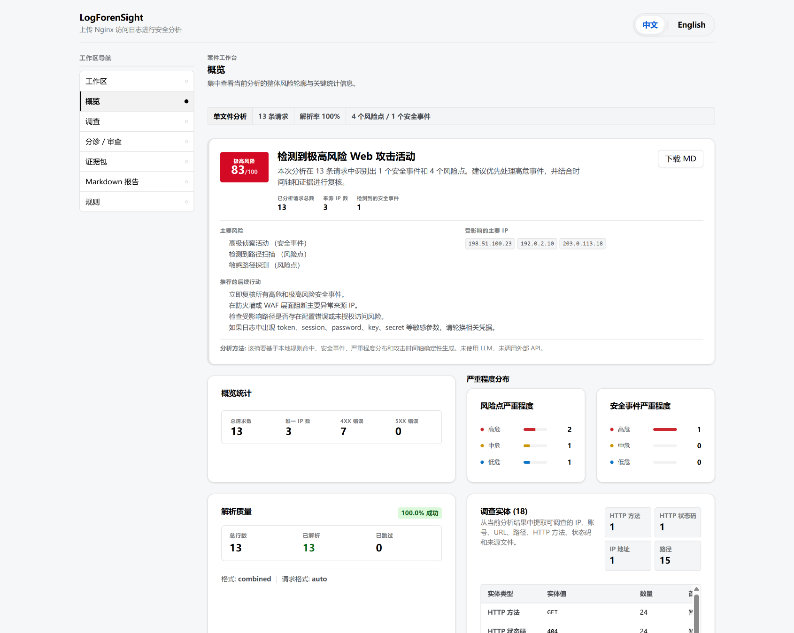
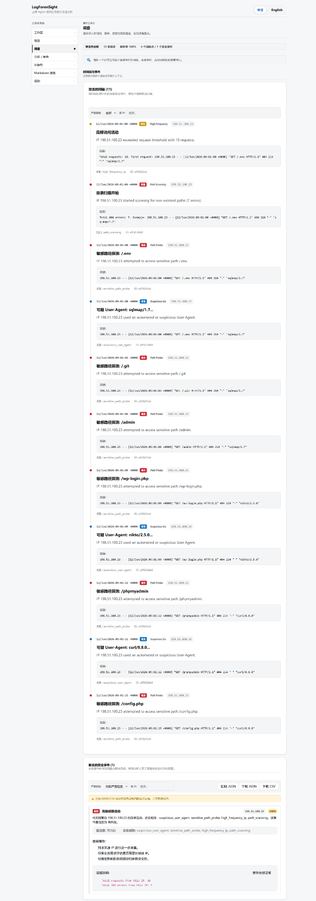
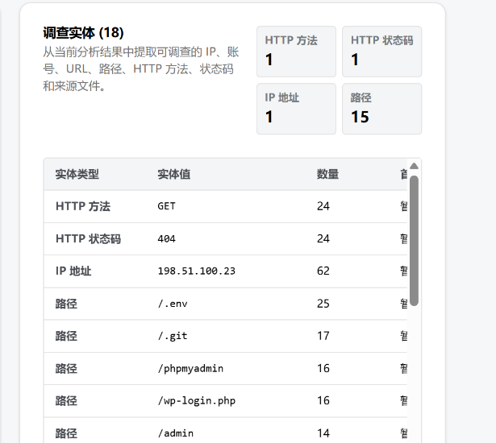
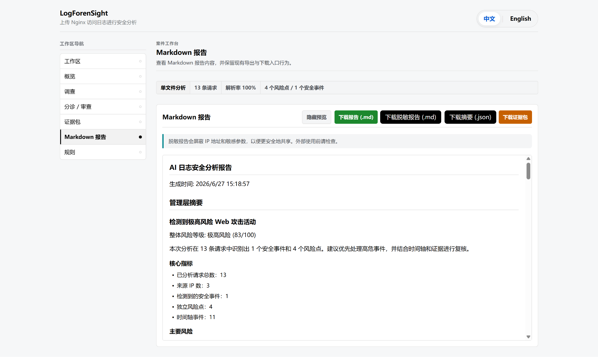

# LogForenSight

> Local-first security log triage for explainable, exportable, privacy-aware evidence handoff.

**LogForenSight** 是一个本地优先的 Web access log 安全分析与处置工作台。项目聚焦安全运营研判流程：日志解析、确定性规则检测、finding 解释、incident 聚合、investigation entities 抽取、triage 处置、case notes 记录、review readiness 检查和 Evidence Pack 导出。

它不是生产级 SIEM、实时检测管道或云端 SOC 平台；工程化部分用于把安全分析流程产品化展示，核心价值是 **local-first、deterministic、explainable、triage-ready、evidence-pack-ready** 的安全日志分析工作流。

[](https://github.com/Calvin1989/LogForenSight/actions/workflows/ci.yml)
[](CHANGELOG.md)
[](LICENSE)


---

## 项目演示截图

以下截图基于本地 demo 样本 `samples/demo_access.log` 生成，用于展示 LogForenSight 的核心安全分析流程：日志解析、风险总览、findings / incidents / timeline、调查实体抽取、分诊复核和 Evidence Pack 交付。

| Overview Dashboard | Findings / Incidents / Timeline |
|---|---|
|  |  |

| Investigation Entities | Evidence Pack / Markdown Handoff |
|---|---|
|  |  |

补充截图：`docs/screenshots/05-triage-review.png`、`docs/screenshots/06-findings-rules-review.png`、`docs/screenshots/07-rules-config.png`。

---

## 面试官 30 秒阅读版

LogForenSight 面向安全运营 / 日志分析 / DFIR 辅助研判场景，基于本地 Nginx / Apache access log 完成可复核的攻击线索分析。项目重点不是包装成生产级 SIEM，而是展示从日志解析、规则命中、告警解释、incident 聚合、调查实体提取、人工分诊到 Evidence Pack 交付的基础安全运营闭环。

项目默认不依赖外部 API、数据库或 LLM；同一日志和规则可以得到稳定结果，便于复测、审计和面试演示。前端和后端工程化设计用于承载安全分析流程，让分析结果更容易被查看、复核、备注和导出。

---

## 核心分析流程

```text
Upload access log
  -> Parse Nginx / Apache log lines
  -> Apply deterministic YAML detection rules
  -> Generate findings with evidence snippets
  -> Aggregate related findings into incidents
  -> Extract investigation entities
  -> Review timeline and rule explanations
  -> Triage findings / incidents and add case notes
  -> Check review readiness and export Evidence Pack
```

---

## 当前完成情况

当前版本聚焦本地安全日志研判演示，已完成从单文件 / 多文件日志上传、解析质量统计、风险评分、findings、incidents、timeline、investigation entities、规则解释、triage、case notes、review readiness 到 Markdown / JSON / CSV / Evidence Pack 导出的完整演示链路。

| 模块 | 当前状态 |
|---|---|
| Access log parsing | 支持 Nginx / Apache combined-style access log 解析与 parse quality 展示 |
| Detection rules | 使用本地 YAML 规则识别敏感路径探测、404 扫描、高频访问、可疑 User-Agent 等行为 |
| Findings / incidents | 展示规则命中、证据片段、严重程度、建议动作，并聚合为安全事件 |
| Investigation entities | 抽取 IP、path、URL、HTTP method、HTTP status、source file 等调查对象 |
| Triage / review | 支持状态、优先级、处置备注、case notes、review readiness 和 next actions |
| Evidence handoff | 支持 Markdown 报告、脱敏报告、摘要 JSON、CSV 和 Evidence Pack 导出 |
| Local-first design | 默认无数据库、无外部 API、无 LLM 依赖，日志分析流程在本地完成 |

---

## 功能亮点

| 能力 | 说明 |
|---|---|
| Deterministic detection | 同一日志与规则得到稳定结果，便于复核、测试和演示。 |
| Explainable findings | 每条 finding 展示规则依据、命中字段、证据片段、严重程度和建议动作。 |
| Incident aggregation | 将分散 findings 聚合为更适合分析师处置的安全事件。 |
| Investigation entities | 自动抽取 IP、URL、path、HTTP method/status、source file 等调查对象。 |
| Timeline review | 按时间顺序展示攻击活动和关键证据，辅助还原事件过程。 |
| Analyst triage | 支持 Open / Investigating / Mitigated / False Positive、优先级和处置备注。 |
| Case notes | 支持 Observation、Hypothesis、Action、Decision 等分析备注。 |
| Review readiness | 导出前检查 findings、incidents、case notes、timeline、rule coverage 和 handoff readiness。 |
| Evidence Pack | 生成可交接 Markdown 证据包，并提供 quality score、export guardrails 和 share-safety 提示。 |
| Bilingual UI | 支持中文 / 英文界面，便于中文简历展示和英文面试演示。 |

---

## 快速开始

### Docker Compose 一体启动

```powershell
docker compose up --build
```

访问：

```text
http://localhost:5173
```

### 本地开发模式启动

后端：

```powershell
cd backend
pip install -r requirements.txt
uvicorn app.main:app --reload
```

前端：

```powershell
cd frontend
npm install
npm run dev
```

推荐先上传：

```text
samples/demo_access.log
```

用于演示单文件日志分析、风险总览、调查实体、分诊复核和 Evidence Pack 导出。随后可使用 `samples/demo_batch_part1.log` 与 `samples/demo_batch_part2.log` 演示多文件 batch 分析。

---

## 推荐演示路径

1. 上传 `samples/demo_access.log`。
2. 查看 parse stats、source files 和 analysis context。
3. 查看 overview dashboard、risk score、severity distribution 和 summary cards。
4. 进入 investigation 页面，检查 findings、incidents 和 timeline。
5. 查看 investigation entities，重点关注 IP、path、HTTP status 和 source file。
6. 展开 finding，说明规则命中原因、证据片段和建议动作。
7. 在 triage / review 中设置状态、优先级和处置备注。
8. 添加 case notes / decision log，检查 review readiness。
9. 打开 Evidence Pack，检查 quality score、export guardrails 和 share-safety review。
10. 导出 Markdown 报告、脱敏报告、摘要 JSON 或 Evidence Pack。

---

## 技术实现概览

| 层级 | 技术 / 设计 |
|---|---|
| Frontend | Vue 3, Vite, shadcn-vue primitives, bilingual UI |
| Backend | Python, FastAPI, Pydantic |
| Detection | Local deterministic rules in YAML |
| Storage | Browser local storage for case workspace / triage / notes |
| Export | CSV / JSON / Markdown download from frontend utilities |
| Validation | Pytest, Vitest, Vite build, Docker Compose config |
| Runtime | Local-first, no database, no external API, no LLM dependency |

工程化部分用于支撑本地演示和分析流程闭环；面试讲解时建议优先说明安全日志研判逻辑，不主动夸大为生产级前后端平台。

---

## 质量验证

当前 release gate 保留基础自动化验证，确保核心解析、检测、导出和前端交互不被破坏。

```powershell
cd backend
python -m pytest
```

```powershell
cd frontend
npm run test
npm run build
```

```powershell
cd ..
docker compose config
git diff --check
```

当前验证快照：Backend `65 passed`，Frontend `51 files / 368 tests passed`，frontend build passed，Docker Compose config valid。

---

## 文档导航

| 文档 | 内容 |
|---|---|
| `docs/demo.md` | 本地演示脚本和讲解顺序 |
| `docs/architecture.md` | 后端、前端、数据流和本地优先架构 |
| `docs/api_contract.md` | FastAPI 请求 / 响应契约 |
| `docs/portfolio.md` | Portfolio / 面试展示说明 |
| `docs/release_notes.md` | 版本演进摘要 |
| `docs/release_checklist.md` | 发布流程和质量门禁 |
| `docs/github_listing.md` | GitHub description、topics、release snapshot 文案 |
| `docs/screenshots/README.md` | 截图说明与补充截图清单 |
| `samples/README.md` | Demo sample 日志说明 |

---

## 适合展示的岗位方向

- 安全运营 / SOC 分析实习
- 日志分析 / 威胁研判实习
- DFIR / Incident Response 辅助分析
- 安全工具开发 / 安全平台辅助开发
- Web 安全服务交付中的日志复核与证据整理

---

## GitHub Topics 建议

`security-tools` · `log-analysis` · `incident-response` · `dfir` · `threat-hunting` · `ioc-extraction` · `detection-engineering` · `fastapi` · `vue` · `local-first`

---

## 项目边界

LogForenSight 当前聚焦 **Web access log analysis** 和本地可复核分析师工作流。

当前项目不声称具备以下能力：

- 生产级 SIEM
- 云原生日志平台
- 实时检测和实时告警管道
- 多租户 SaaS
- 自动化封禁或 SOAR 编排
- LLM SOC copilot

更准确的定位是：一个用于 portfolio、面试演示和本地研判练习的安全日志分析工作台。

---

## License

MIT
