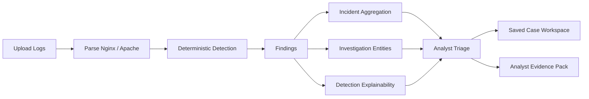

# LogForenSight

> 🛡️ Local-first security log triage for analysts who need explainable, exportable, and privacy-safe evidence.

**本地优先、零外部依赖、可解释、可导出的 Web 日志安全分析与处置工作台。**

[](https://github.com/Calvin1989/LogForenSight/actions/workflows/ci.yml)
[](CHANGELOG.md)
[](LICENSE)


## ✨ 30 秒看懂 LogForenSight

LogForenSight 不是 SIEM，也不是把日志交给 AI 猜测的聊天式工具。<br>
它是一条本地运行的安全分析链路：解析 Web 访问日志、执行确定性检测、聚合 incidents、提取 IOC、解释每条 detection，并导出可交接的 Analyst Evidence Pack。

- 🧪 确定性检测：相同输入得到相同输出，便于复核、测试和演示
- 🔍 调查实体抽取：IP、URL、账号、路径、HTTP 状态码统一提取
- 🧭 分析师处置：状态、优先级、备注、`Needs review` / `待复核` 提示
- 📦 证据包导出：包含 metadata、privacy note、validation summary

## 🚀 核心亮点

| 能力 | 解决的问题 |
|---|---|
| 🧾 Nginx / Apache 日志解析 | 将原始 access logs 转成结构化记录，并返回 parse quality 与 skipped samples |
| 🧠 Deterministic Detection | 避免黑盒输出，支持复核、测试与稳定演示 |
| 🔗 Incident Aggregation | 把离散 findings 聚合成更适合处置的 incidents |
| 🧬 IOC / Investigation Entities | 快速定位 IP、账号、URL、路径、HTTP 方法、状态码等调查对象 |
| 🔎 Detection Explainability | 展示规则依据、命中字段、命中指标与证据片段 |
| ✅ Analyst Triage Workflow | 跟踪 `Open / Investigating / Mitigated / False Positive`，并显示 `Needs review` / `待复核` |
| 💾 Saved Case Workspace | 在本地保存、搜索、过滤、导入导出分析案例 |
| 📦 Evidence Pack Export | 导出适合交接、复盘、工单流转的 Markdown 证据包 |

## ⚡ 快速开始

```powershell
docker compose up --build
```

访问：

```text
http://localhost:5173
```

如需排查 Windows 端口占用，请参考 `docs/release_notes.md` 中已有说明；本次文档修订不修改默认端口，也不改变 `npm run dev` 行为。

## 🎯 适合谁？

- 蓝队 / SOC / DFIR 学习与演示
- 想展示安全工程能力的 portfolio 项目
- 需要本地处理敏感日志的分析场景
- 想理解 detection engineering / triage workflow 的开发者

## 🧭 工作流



## 🤖 为什么核心检测不依赖 LLM？

- 安全日志分析首先需要可复现，相同输入应得到相同输出。
- 敏感日志默认不应上传第三方，local-first 比默认接入外部模型更稳妥。
- 确定性规则更适合审计、复盘、测试和检测工程说明。
- LLM 可以作为外围辅助能力，但不是当前核心检测路径。

## 项目定位

LogForenSight 面向安全分析师、DFIR 实践者、蓝队工程师和开发者，聚焦 `security log analysis`、`incident response`、`threat hunting`、`ioc extraction` 等真实分析场景。它不是“看上去很智能”的首页包装，而是一条可复核、可导出、可本地保存的确定性分析链路。

当前版本覆盖的真实工作流包括：

- 单文件与多文件日志分析，适合从单次访问排查扩展到案件级分析。
- Nginx / Apache access log parsing，并提供 parse quality、skipped samples 和 source files 归因。
- deterministic rule detection，将原始请求转成结构化 findings。
- incident aggregation，把相关 findings 聚合为更适合处置的 incidents。
- Executive Summary，提供面向管理层或展示场景的确定性风险摘要。
- Saved Case Workspace，用于本地保存、搜索、过滤、导入导出案例。
- Analyst Triage Workflow，支持状态、优先级、备注与处置跟踪。
- IOC / Investigation Entities extraction，提取 IP、账号、URL、路径、HTTP 方法、状态码和 source files。
- Detection Explainability drilldown，帮助分析师查看规则依据、命中指标和证据片段。
- Analyst Evidence Pack export，输出适合交接、复盘和工单流转的 Markdown 证据包。
- Evidence Pack metadata / privacy note / validation summary，强化导出结果的说明性与可审计性。
- v2.9 triage status summary 与 `Needs review` / `待复核` 提示，帮助分析师快速识别未处置或仍需关注的对象。

## 核心功能

- **日志解析**: 支持 single-file / multi-file log analysis，覆盖 Nginx / Apache access log parsing，并展示解析质量反馈。
- **检测与聚合**: 使用 deterministic rule detection 生成 findings，并进行 incident aggregation。
- **摘要输出**: 自动生成 Executive Summary，提供确定性的风险分数、风险等级和关键指标。
- **案件工作区**: 提供 Saved Case Workspace，本地保存案例，支持搜索、过滤、JSON 导入导出与历史管理。
- **分析师处置**: 提供完整的 Analyst Triage Workflow，支持 `Open / Investigating / Mitigated / False Positive` 状态、优先级和备注。
- **待复核提示**: 在 Findings 和 Incidents 中提供 `Needs review` / `待复核` 提示，并显示 v2.9 triage status summary。
- **调查实体抽取**: 执行 IOC / Investigation Entities extraction，统一展示去重计数、时间范围和关联 source files。
- **检测解释**: 提供 Detection Explainability drilldown，展示规则上下文、严重程度依据、命中指标、证据片段和建议动作。
- **证据导出**: 支持 Analyst Evidence Pack export，包含 Evidence Pack metadata、privacy note、validation summary 以及 triage 内容。
- **双语界面**: 前端保留 bilingual UI，适合中文主导使用，也方便英文关键词检索与展示。

<details>
<summary><strong>本地开发</strong></summary>

后端：

```bash
cd backend
pip install -r requirements.txt
uvicorn app.main:app --reload
```

前端：

```bash
cd frontend
npm install
npm run dev
```

</details>

## 技术栈

- **前端**: Vue 3、Vite、组合式逻辑、轻量双语 UI。
- **后端**: Python 3.11、FastAPI、Pydantic。
- **验证**: Pytest、Vitest、Docker Compose。
- **运行方式**: local-first、无数据库、零外部 API、无 LLM 依赖。

## 核心架构

项目的主链路可以概括为：

1. 上传单个或多个 Web access logs。
2. 解析为结构化记录，并返回 parse quality 与 skipped samples。
3. 执行 deterministic detection rules，生成 findings。
4. 执行 incident aggregation，将相关 findings 组织为 incidents。
5. 生成 Executive Summary、Investigation Entities、Detection Explainability 等分析视图。
6. 在 Analyst Triage Workflow 中补充状态、优先级与分析师备注。
7. 通过 Saved Case Workspace 将结果持久化到本地案例空间。
8. 导出 Markdown 报告或 Analyst Evidence Pack，形成交接与复盘材料。

## 本地优先设计

- 日志解析、检测、处置、案例保存和导出都以本地使用为默认前提。
- 不要求外部数据库，不依赖外部 API，也不把日志默认发送给第三方服务。
- Saved Case Workspace 在保留分析结果的同时避免直接把原始日志文本作为默认存档内容。
- Analyst Evidence Pack export 强调 privacy note 和 validation summary，帮助说明哪些信息来自本地规则、哪些内容经过脱敏或摘要。
- 这种 local-first 设计更适合隐私敏感环境、实验室环境、内网演示和面试讲解。

## 适合面试讲解的技术点

- 日志解析与解析质量反馈：如何从原始 access logs 得到结构化记录，并对 skipped lines 给出可见反馈。
- Finding -> Incident 聚合：如何把离散命中整理为更贴近真实事件的 incident 视图。
- Deterministic Executive Summary：如何生成稳定、可复核、可展示的高层摘要。
- Local-first Case Workspace：如何在不引入数据库的情况下完成案例保存、搜索与迁移。
- Triage Workflow：如何把“检测结果”进一步推进到“可处置状态管理”。
- IOC extraction：如何从 findings / incidents / report context 中抽取 Investigation Entities。
- Detection explainability：如何让每条 finding 都能回溯到规则依据、命中指标和证据。
- Evidence Pack export：如何产出适合 handoff、ticket、复盘的 Markdown 证据包。
- Bilingual UI：如何用轻量方案同时支持中文和英文界面。
- Privacy by design：如何在本地优先前提下处理日志、导出、脱敏和元数据边界。

## Demo 路径

建议按下面的顺序演示项目：

1. 上传单个 Nginx 或 Apache 日志，展示 parse quality 和 findings。
2. 上传多个日志文件，展示 multi-file analysis 与 source file 归因。
3. 查看 findings 到 incidents 的聚合结果，以及 Executive Summary。
4. 展示 Investigation Entities 和 IOC extraction 的去重结果。
5. 展开 Detection Explainability drilldown，说明规则依据和证据片段。
6. 演示 Analyst Triage Workflow，补充状态、优先级、备注与 `Needs review` 提示。
7. 保存到 Saved Case Workspace，展示本地案例管理。
8. 导出 Analyst Evidence Pack，说明 metadata、privacy note 和 validation summary。

## 📚 文档导航

| 文档 | 内容 |
|---|---|
| `docs/demo.md` | 推荐演示路径 |
| `docs/portfolio.md` | 项目展示与面试讲解 |
| `docs/release_notes.md` | 版本说明 |
| `docs/architecture.md` | 架构说明 |
| `docs/api_contract.md` | API 契约 |
| `docs/github_listing.md` | GitHub About / Topics 建议 |
| `docs/screenshots/README.md` | 截图规划说明 |

## GitHub Topics 建议

建议在 GitHub 仓库 Topics 中使用以下标签：

```text
security-tools
log-analysis
incident-response
dfir
threat-hunting
ioc-extraction
detection-engineering
fastapi
vue
local-first
```

## 项目边界与后续方向

- 当前聚焦 Web access log analysis，不扩展为通用 SIEM 或云原生日志平台。
- 当前核心价值是 deterministic、local-first、可解释、可导出，而不是追求大模型生成式能力。
- 当前保留轻量部署和零外部依赖边界，不引入数据库、队列、云服务或额外基础设施。
- 后续如果继续演进，更适合在规则能力、导出质量、案例管理和调查视图上深化，而不是牺牲可复现性去换取不可控的智能化包装。

## License

MIT
