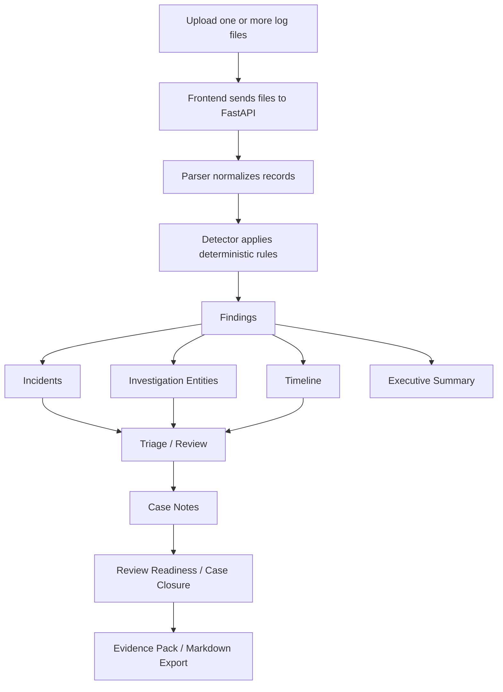

# Architecture Overview

LogForenSight is a local-first security log triage application built from a Python FastAPI backend and a Vue 3 / Vite frontend. The system is intentionally deterministic, auditable, and export-oriented.

---

## 1. Design Principles

- **Local-first**: logs stay on the analyst machine by default.
- **Deterministic**: no LLM or external API is required for the core detection path.
- **Explainable**: findings expose rule context, matched fields, evidence snippets, and suggested actions.
- **Analyst-friendly**: the UI supports triage, case notes, readiness checks, and export handoff.
- **Tested**: backend, frontend, layout, UX, smoke, and i18n tests are part of release gates.

---

## 2. Backend

The backend is a small FastAPI application under `backend/app/`.

| Module | Responsibility |
|---|---|
| `main.py` | FastAPI routes such as `/api/analyze` and request/response integration. |
| `schemas.py` | Pydantic data contracts shared by API responses. |
| `parser.py` | Nginx / Apache access log parsing and parse quality accounting. |
| `config_loader.py` | YAML rule configuration loading. |
| `detector.py` | Deterministic local rule matching. |
| `incident.py` | Incident aggregation from findings. |
| `executive_summary.py` | Human-readable summary and risk scoring. |
| `rule_coverage.py` | Rule coverage reporting. |
| `rule_tuning.py` | Temporary rule tuning support. |
| `sanitizer.py` | Report sanitization helpers. |
| `timeline.py` | Timeline event construction. |
| `service.py` | Orchestration across parser, detector, incident, summary, coverage, and timeline. |

The backend does not require a database and does not call external services.

---

## 3. Frontend

The frontend is a Vue 3 SPA under `frontend/src/`.

### Core surfaces

| Area | Representative components |
|---|---|
| Workspace shell | `App.vue`, `WorkspaceShell.vue`, `WorkspaceNav.vue` |
| Upload and history | `FileUpload.vue`, `RecentAnalyses.vue`, `AnalysisContextBar.vue` |
| Overview | `ExecutiveSummary.vue`, `SummaryCards.vue`, `SeverityDistribution.vue`, `ParseStatsCard.vue`, `InvestigationEntities.vue`, `TopList.vue` |
| Investigation | `FindingsList.vue`, `IncidentsList.vue`, `TimelineView.vue`, `FindingExplainability.vue` |
| Review / triage | `TriagePanel.vue`, `CaseWorkspace.vue`, `CaseNotesPanel.vue`, `ReviewReadinessPanel.vue` |
| Case closure | `CaseClosureChecklist.vue`, `CaseClosureEvidenceGaps.vue`, `CaseClosureNextActions.vue` |
| Evidence Pack | `EvidencePackExportPreview.vue`, `EvidencePackExportGuardrails.vue`, `EvidencePackQualityScore.vue`, `EvidencePackShareSafety.vue` |
| Report tools | `MarkdownReport.vue`, `ReportComparison.vue`, `RuleConfigPanel.vue`, `RuleTuningPanel.vue`, `RuleCoverage.vue` |

### Frontend architecture notes

- UI uses Vue 3, Vite, npm, and shadcn-vue primitives.
- Layout uses dashboard grids, compact cards, status rows, bounded scroll panels, and responsive breakpoints.
- Long Evidence Pack, Markdown, raw snippet, and entity data are constrained with scroll containers to avoid page blowout.
- Empty, loading, disabled, unavailable, copied, saved, and error states are handled in the UI.
- i18n is bilingual Chinese/English in `frontend/src/i18n.js`.

---

## 4. Analysis Flow

---

## 5. Local Persistence

The frontend stores local analyst workflow state in browser local storage:

- saved case workspace
- analysis history
- triage state
- case notes / decision log

The storage layer intentionally avoids persisting raw file objects or unnecessary raw log payloads.

---

## 6. Evidence Pack Architecture

Evidence Pack export is a frontend Markdown handoff surface that aggregates:

- metadata and parse stats
- executive summary
- findings and incidents
- investigation entities
- timeline
- rule coverage
- detection explainability
- triage summary
- case notes
- review readiness
- closure checklist / evidence gaps / next actions
- quality score
- export guardrails
- share safety review

v2.39-v2.42 refined this area into an export cockpit with bounded long content, disabled/unavailable states, copy/download feedback, and smoke tests.

---

## 7. Validation Model

Current release gate for v2.42-local:

- Backend: `python -m pytest` → 65 passed
- Frontend: `npm run test` → 51 files / 368 tests passed
- Frontend build: `npm run build` → passed
- Docker: `docker compose config` → valid
- Whitespace: `git diff --check` → clean

The frontend test suite includes component tests plus layout, UX, smoke, i18n, export, storage, and utility coverage.
